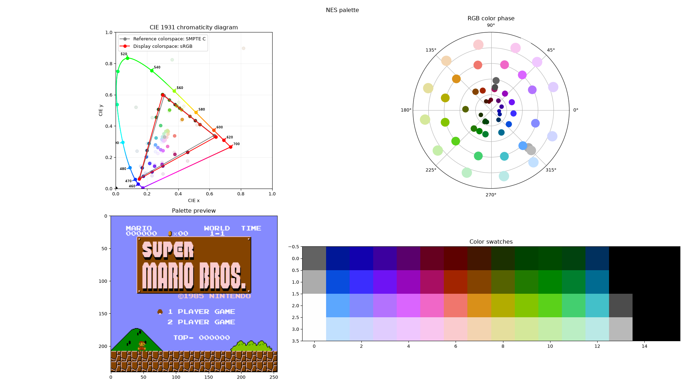
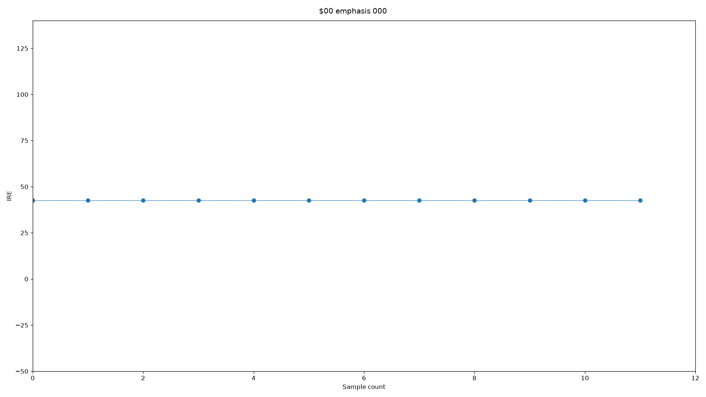
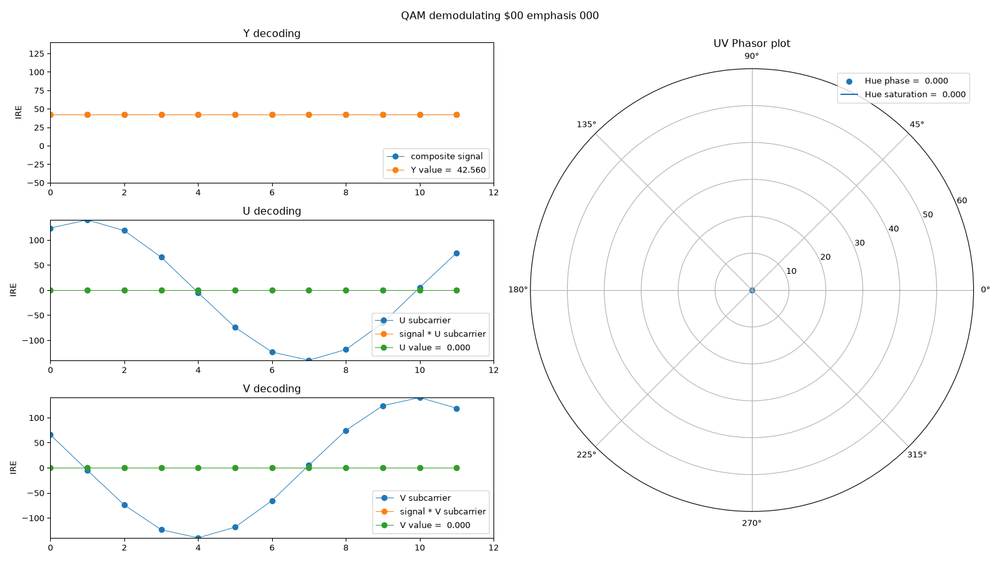
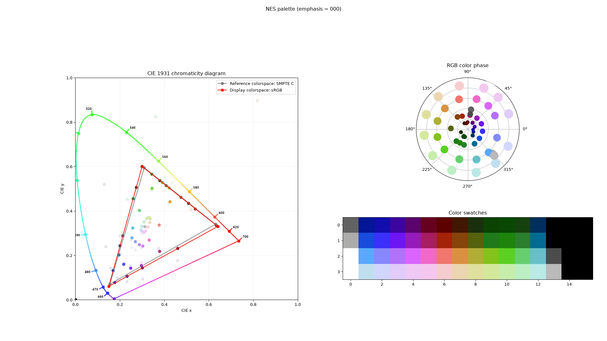
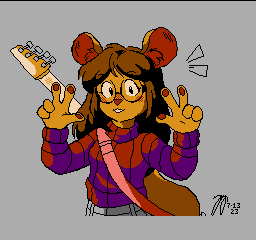
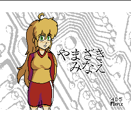

# Pally

Previously known as `palgen_persune`, `palgen-persune`.

Yet another NES palette generator, made with Rust!

My first big Rust project.






Something to note: there _is_ no one true NES palette, but this generator
can pretty much approach colors that looks good enough for use in gaming, art,
and color work. feel free to adjust!




## Usage

```sh
TODO! CLI interface, and also GUI
```

## License

This work is licensed under the MIT-0 license.

Copyright (C) Persune 2025.

## Credits

Dedicated to:

- NewRisingSun
- L. Spiro
- lidnariq
- PinoBatch
- jekuthiel
- _aitchFactor
- zeta0134

This would have not been possible without their help!
